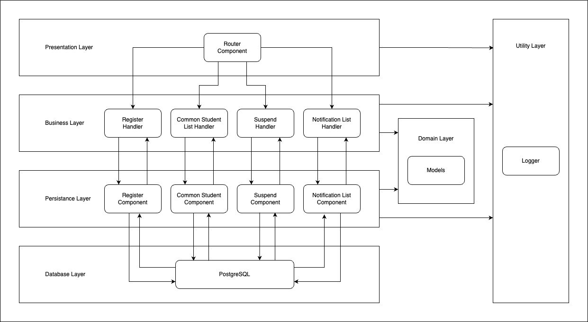

## Design Decisions

### Architecture
- Monolithic: Relatively small server, no need for microservices
- Layered: Business layer (router and handler folders), data access layer (db folder) for separation of concerns
- Did not use microservice architecture because I feel that it is overkill for this project, and it is easier to deploy a monolithic application. However, if the application is expected to scale up in the future, microservice architecture will be more suitable.

---

### Database
- 3 tables: students, teachers, registrations
- students' schema consists of id, email, and is_suspended to implement a 'soft delete' when the suspend api is called
- teachers' schema consists of id and email
- registrations' schema consists of id, student_id, and teacher_id, with a composite primary key (teacher_id, student_id) to identify the registration records, as it is a many-to-many relationship.  
teacher_id and student_id are also foreign key to the teachers and students table respectively to ensure referential integrity.  
teacher_email and student_email is not stored in the registrations table as it is redundant, and can be retrieved from the teachers and students table respectively.

---

### APIs
- General: All handlers first checks either the json body or the query parameters to validate the input, using gin model binding and validation (declared under model folder), then calls the db to perform the necessary operations.
- POST /api/register: The db first checks if the teacher and student exists. If not, it creates the teacher and student record. Then checks if the registration already exists. If not, it creates the registration record.
- GET /api/commonstudents: The db first retrieve all teacher records. If there is a teacher not found, means it has never been registered before, so return an empty list. Else, it retrieves all the common students registered under the teachers. This is done by querying the registration table, filtering the records by the teacher ids, then grouping by student id, and finally filtering the records by the number of teachers it is registered under.
- POST /api/suspend: The db first checks if the student exists. If not found, return an error. Then checks if the student is already suspended. If not, it updates the student record to set is_suspended to true.
- POST /api/retrievefornotifications: The handler first extract out all the mentioned students in the notification message, filter out suspended students, and store it in a map. This is to eliminate duplicates. Then the db retrieves all the students registered under the teacher, and filter out suspended students. Finally, it converts the map to a slice and sort it for consistent order.

---

### Area of Improvement
- Can apply singleton pattern to DB and Logger to prevent multiple instances of the same object being created.
- Use DAO pattern for student, teacher, and registration instead of the current implementation, where one API has one db component by itself. This will allow the db calls to be more reusable.